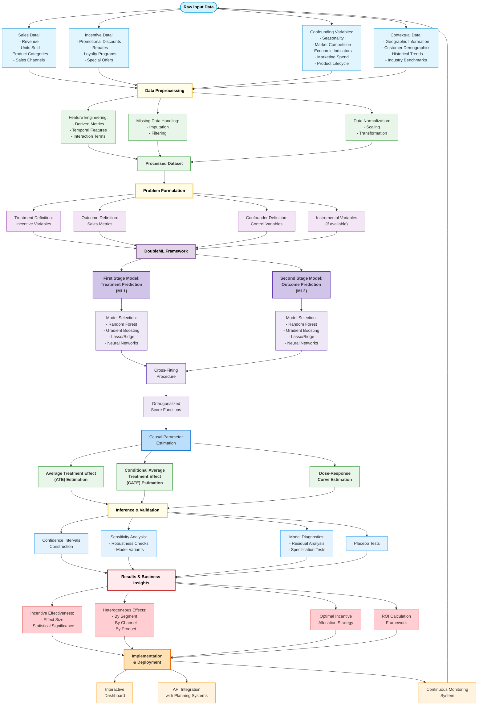

# Incentive-Inference
Causal Inference Model: Sales-Incentive Analysis using DoubleML

## System Architecture

The diagram above illustrates our approach to causal inference in sales-incentive analysis. Here's a breakdown of the key components:

### 1. Data Input Layer

The foundation of the analysis begins with four primary data sources:

- **Sales Data**: Revenue metrics, units sold, product categories, and sales channel information.
- **Incentive Data**: Details of promotional discounts, rebates, loyalty programs, and special offers.
- **Confounding Variables**: Factors that influence both incentives and sales, including seasonality, market competition, economic indicators, marketing spend, and product lifecycle stage.
- **Contextual Data**: Supporting information such as geographic data, customer demographics, historical trends, and industry benchmarks.

### 2. Data Preprocessing

Before analysis, data undergoes several preparation steps:

- **Feature Engineering**: Creating derived metrics, temporal features, and relevant interaction terms.
- **Missing Data Handling**: Implementing appropriate imputation strategies or filtering rules.
- **Data Normalization**: Applying scaling and transformations to ensure comparability across variables.

### 3. Problem Formulation

The causal question is precisely defined through:

- **Treatment Definition**: Identifying the specific incentive variables whose effects we want to measure.
- **Outcome Definition**: Specifying the sales metrics that serve as outcome variables.
- **Confounder Definition**: Explicitly defining control variables that might influence both treatment and outcome.
- **Instrumental Variables**: When available, identifying variables that influence treatment but not outcome directly.

### 4. DoubleML Framework

At the core of the analysis, the DoubleML methodology employs:

- **First Stage Model (ML1)**: Machine learning models to predict treatment (incentives) using confounding variables.
- **Second Stage Model (ML2)**: Machine learning models to predict outcomes (sales) using confounding variables.
- **Model Selection**: Options including Random Forest, Gradient Boosting, Lasso/Ridge regression, and Neural Networks.
- **Cross-Fitting Procedure**: K-fold sample splitting to prevent overfitting and reduce regularization bias.
- **Orthogonalized Score Functions**: Mathematical transformations that enable unbiased estimation of causal effects.

### 5. Causal Parameter Estimation

The framework estimates several causal parameters:

- **Average Treatment Effect (ATE)**: The overall effect of incentives on sales across the entire population.
- **Conditional Average Treatment Effect (CATE)**: How treatment effects vary across different segments or conditions.
- **Dose-Response Curves**: Estimating effects across varying levels of incentive intensity.

### 6. Inference & Validation

Results undergo rigorous validation through:

- **Confidence Intervals**: Quantifying uncertainty in the estimated effects.
- **Sensitivity Analysis**: Testing robustness to different model specifications and assumptions.
- **Model Diagnostics**: Analyzing residuals and conducting specification tests.
- **Placebo Tests**: Validating results against null cases where no effect should exist.

### 7. Business Insights

The analysis generates actionable insights including:

- **Incentive Effectiveness**: Quantified effect sizes with statistical significance.
- **Heterogeneous Effects**: How incentive impact varies by segment, channel, or product.
- **Optimal Allocation**: Strategies for distributing incentive budgets for maximum impact.
- **ROI Calculation**: Framework for measuring return on incentive investments.

## Technical Implementation

This system is implemented using:

- **Python-based analysis** with EconML and DoubleML packages
- **Statistical modeling** frameworks including scikit-learn and statsmodels
- **Data processing** with pandas and numpy
- **Visualization** through matplotlib, seaborn, and plotly

## Business Impact

Implementation of this causal inference framework delivers:

- **Unbiased estimates** of incentive effectiveness
- **Reduced spending** on ineffective promotions
- **Optimized allocation** of incentive budgets
- **More accurate forecasting** of sales response to incentives

## Future Directions

Planned enhancements include:

- Integration with real-time sales data systems
- Expansion to include competitive response modeling
- Enhanced heterogeneous effect estimation
- Automated incentive recommendation engine

---

*This documentation describes a methodological approach to causal inference for sales-incentive analysis using DoubleML, providing a framework for understanding true causal relationships rather than mere correlations.*
